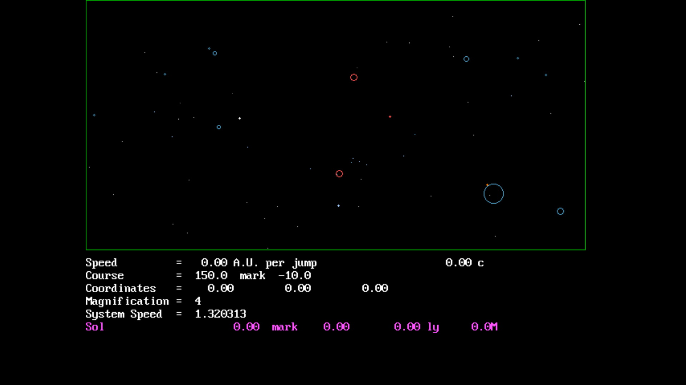

# 3D-STAR

**Version 1.0 — July 1995**

A QBasic/QuickBASIC program I wrote in high school that lets you fly through
our stellar neighborhood and watch the sky from anywhere within a few
thousand light-years of Sol. Stars are stored in true galactic (X, Y, Z)
coordinates, so as you move their positions, apparent magnitudes, and
constellations all shift correctly. This is the predecessor to my HYGMap
web application.

Development ran from early 1993 through July 1995, going from a simple
QBasic interpreter script with 64 stars (v0.01, Jan 1994) to a compiled
QuickBASIC 4.5 executable with 407 objects, a star map, an info bar, and
course-to-target navigation (v1.0, Jul 1995).



## Files

| File          | Purpose                                                          |
|---------------|------------------------------------------------------------------|
| `3DSTAR.BAS`  | Main program — renders the sky and handles flight controls       |
| `3DDATA.BAS`  | Data-entry tool; converts RA/Dec + distance into galactic X, Y, Z|
| `3DSTAR.EXE`  | Main program, compiled                                           |
| `3DDATA.EXE`  | Data-entry tool, compiled                                        |
| `3DSTAR.DAT`  | Star database — 358 stars + 49 nebulae and clusters = 407 total  |
| `3DSTAR.GIF`  | Reference image explaining the on-screen coordinate system       |
| `3DSTAR.TXT`  | Original documentation and full development history              |
| `3D.BAT`      | Legacy launcher (v0.01) — runs `qbasic /run 3dstar`              |

## Star catalog

- The 25 brightest stars (as seen from Earth)
- The 26 nearest stars to Earth (including Sol)
- The brighter stars of every major constellation
- 49 deep-sky objects: nebulae (`NEB`), open clusters (`OCL`), globular
  clusters (`GCL`)

Deep-sky objects are stored with a radius in light-years instead of an
absolute magnitude, and are drawn as circles sized by angular diameter
instead of points.

## Running it

On DOS or DOSBox:

```
3DSTAR
```

Enter the number of stars to load (blank = all 407). On a < 486DX, load
fewer to keep the frame time reasonable — the `System Speed` readout at
the bottom of the screen tells you seconds-per-frame.

At the menu you can type a star's name as the starting point and you'll
be placed at its coordinates. Blank accepts `(0, 0, 0)` — Sol.

## Controls

| Key           | Action                                                 |
|---------------|--------------------------------------------------------|
| `8` / `2`     | Pitch up / down 5°                                     |
| `4` / `6`     | Yaw left / right 5°                                    |
| `5`           | Steer toward the currently-tracked star (may need a   |
|               | few presses to zero the bearing)                       |
| `A` / `a`     | Double / halve speed                                   |
| `Z` / `z`     | Double / halve magnification                           |
| `N` / `n`     | Track next / previous object in the info bar           |
| `M`           | Toggle Star Map (top-down view of your neighborhood)   |
| `Q` / Ctrl-Break | Quit                                                |

Speed auto-switches its unit from light-years/jump to AU/jump when you
slow below 0.01 ly. At the top end, speed can be arbitrarily high —
millions or billions of c — the display shows current velocity as a
multiple of lightspeed, computed from distance-per-jump ÷ wall-clock
time between jumps.

## On-screen readout

- **Speed** — ly or AU per jump, plus multiple of *c*
- **Course** — galactic longitude `mark` galactic latitude
  (0 mark 0 = straight toward the galactic core)
- **Coordinates** — current (X, Y, Z) in light-years, origin at Sol
- **Magnification** — in flight mode: sky zoom. In star-map mode:
  pixels per light-year
- **System Speed** — wall-clock seconds per frame
- **Info bar (magenta)** — tracked object's name, bearing, distance,
  and apparent magnitude from current location

## Star Map mode

Press `M` to toggle a top-down view (looking "down" the +Z axis). Your
ship is the small cyan circle in the center; stars are drawn at their
real (X, Y) positions with brightness set by *absolute* magnitude rather
than apparent magnitude. Useful for navigation — you can see which
stars are actually near you rather than just which ones look bright
from your window.

## How it works

### `3DDATA` — entering new objects

Takes RA/Dec, distance (ly), absolute magnitude (or radius, for
non-stellar objects), and spectral/object type. Converts equatorial
rectangular coordinates into galactic rectangular coordinates via a
three-angle rotation with α = 62.53°, β = 78.56°, γ = 33.02°. Appends to
`3DSTAR.DAT`.

Spectral codes: `O B A F G K M` for stars, `W N` for Wolf-Rayet / carbon
stars, `NEB OCL GCL` for deep-sky objects.

### `3DSTAR` — the main loop

```
CALL PalSet        ' adjust VGA palette for better spectral colors
CALL LoadStars
CALL Menu
CALL MakeScreen
DO
  CALL Calc        ' transform every object into view-space
  CALL PlotStars   ' erase last frame's pixel, draw new one
  CALL MoveShip    ' advance observer by current velocity vector
  CALL GetKey      ' INKEY$ polling
LOOP
```

Per-object each frame:

1. Subtract observer position.
2. Rotate by the current heading (galactic longitude/latitude).
3. For stars: project the rotated vector to spherical (θ, φ) and map to
   the 640×480 screen. Apparent magnitude from the new distance:
   `m = M − 5 + 5·log₁₀(d / 3.26 pc)`. Brightness bucket picks a shade
   from the star's spectral-class palette row.
4. For nebulae/clusters: angular diameter is `atan(r / d)` scaled to
   pixels; drawn as a filled circle rather than a point.
5. Erase the pixel from the previous frame (plus four neighbors for the
   brightest stars) and draw the new one. `ThisHop` / `LastHop` toggle
   between two buffer slots so the erase finds last frame's screen
   position.

Course-to-target (`5` key) just adds the tracked star's current bearing
(θ, φ) to the ship's heading — approximate, so hitting `5` a few times
converges on it.

## Version history (from `3DSTAR.TXT`)

| Date           | Version | Notes                                                    |
|----------------|---------|----------------------------------------------------------|
| Early 1993     | —       | First attempt, random stars, stalled on quadrant math    |
| 1993-12-28     | —       | Restarted; tackling spherical coordinate translation     |
| 1993-12-30     | —       | Derived rotation equations from 2D polar rotations       |
| 1994-01-02     | 0.01    | First working version — 64 stars, QBasic interpreter     |
| 1994-01-30     | 0.90    | Compiled with QuickBASIC 4.5; palette fixed; structured  |
| 1994-02-02     | 0.91    | 333 stars; info bar added                                |
| 1994-02-04     | 0.92    | Course-to-star; starting-location by name                |
| 1994-02-21     | 0.93    | 357 stars                                                |
| 1994-05-19     | 0.94    | First public release; variable star-count loading        |
| 1994-06-04     | 0.95    | Star Map mode                                            |
| 1994-06-05     | —       | Began adding nebulae and clusters                        |
| 1995-07-16     | **1.0** | Final release                                            |
